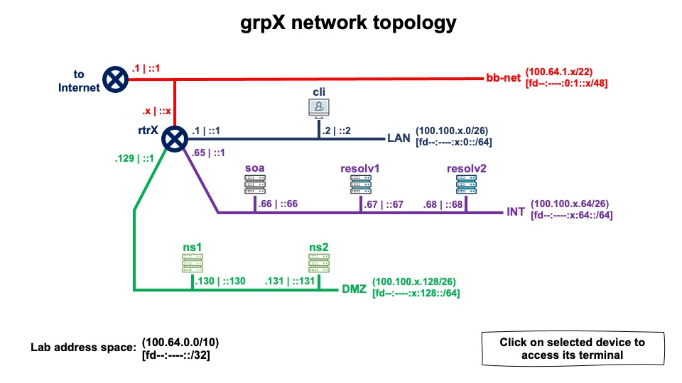

# DNS Hackathon (Lacnic 42)


**Tutores**:

* ***Carlos Martínez***

* ***Hugo Salgado***

* ***Nicolás Antoniello***


## Objetivo

El objetivo del Hackathon es por un lado plantear una serie de desafíos o actividades operativas en torno al Sistema de Nombres de Dominio (DNS) a realizar a lo largo de la semana, donde cada participante en forma individual o en grupos, vaya completando con la finalidad de mejorar, colaborar o adquirir experiencia en conjunto con el resto de los participantes.

Recuerden que **no es necesario ni obligatorio completar todos los niveles**, lo que esperamos es que puedan elegir los temas que mas les interesan y profundizar en ellos.


------


# Topologia de red de un grupo X [grpX]





```
     EQUIPO          DIRECCION IPv4            DIRECCION IPv6
+--------------+-----------------------+-----------------------------+
| grpX-cli     | 100.100.X.2 (eth0)    | fd9d:6914:X::2 (eth0)       |
+--------------+-----------------------+-----------------------------+
| grpX-ns1     | 100.100.X.130 (eth0)  | fd9d:6914:X:128::130 (eth0) |
+--------------+-----------------------+-----------------------------+
| grpX-ns2     | 100.100.X.131 (eth0)  | fd9d:6914:X:128::131 (eth0) |
+--------------+-----------------------+-----------------------------+
| grpX-resolv1 | 100.100.X.67 (eth0)   | fd9d:6914:X:64::67 (eth0)   |
+--------------+-----------------------+-----------------------------+
| grpX-resolv2 | 100.100.X.68 (eth0)   | fd9d:6914:X:64::68 (eth0)   |
+--------------+-----------------------+-----------------------------+
| grpX-rtr     | 100.64.1.X (eth0)     | fd9d:6914:X::1 (eth1)       |
|              | 100.100.X.65 (eth2)   | fd9d:6914:X:64::1 (eth2)    |
|              | 100.100.X.193 (eth4)  | fd9d:6914:X:192::1 (eth4)   |
|              | 100.100.X.129 (eth3)  | fd9d:6914:X:128::1 (eth3)   |
|              | 100.100.X.1 (eth1)    | fd9d:6914:0:1::X (eth0)     |
+--------------+-----------------------+-----------------------------+
| grpX-soa     | 100.100.X.66 (eth0)   | fd9d:6914:X:64::66 (eth0)   |
+--------------+-----------------------+-----------------------------+
```

Donde en esta práctica **solamente** vamos a acceder a los siguientes equipos:

* **grpX-cli** : cliente
* **grpX-resolv1** (BIND preinstalado) y **grpX-resolv2** (UNBOUND preinstalado) : servidores recursivos
* **grpX-soa** (BIND preinstalado) : servidor autoritativo oculto (primario)
* **grpX-ns1** (BIND preinstalado) y **grpX-ns2** (NSD preinstalado) : servidores autoritativos secundarios


---


## Niveles

El mismo consta de 6 niveles (3 para servidores DNS Recursos y 3 para servidores DNS Autoritativos):


#### A nivel de Recursivos

1. Configurar dos servidores de DNS recursos uno de ellos utilizando el software BIND (***resolv1***) y el otro utilizando el software UNBOUND (***resolv2***) ; asegurándoselas en particular de no generar un servidor DNS recurso abierto, limitando el acceso solamente a los bloques de direcciones del Laboratorio.
2. Configurar o verificar que se encuentra funcionando correctamente las extensiones/protocolos validación DNSSEC y QNAME Minimization.
3. Extra: Configurar Hyperlocal de la Zona Raíz del DNS a nivel del servidor Recursivo.


#### A nivel de Autoritativos

1. Configurar un servidor Autoritativo (***soa***) siguiendo los lineamientos establecidos para la creación de la Zona, utilizando el software BIND.
2. Configurar otros 2 servidores Autoritativos (***ns1*** y ***ns2***) como secundarios del anterior, estableciendo lo necesario para que dichos secundarios sirvan la zona transfiriendo la misma desde el primario mediante el protocolo XFR. Estos 2 servidores públicos utilizarán los software BIND y NSD respectivamente.
3. Firmar la Zona en el servidor primario utilizando el protocolo DNSSEC siguiendo los criterios establecidos para ello (algoritmo utilizado para la firma, tiempo de validez de la misma, etc).


------


## Directivas para cada nivel


#### A nivel de Recursivos

##### Nivel 1

- Rango de direcciones IPv4 del laboratorio: 100.100.0.0/16
- Rango de direcciones IPv6 del laboratorio: fd9d:6914::/32
- Asegurarse de permitir tanto consultas por IPv4 como por IPv6


##### Nivel 2

- Verificar que este realizando validación DNSSEC (por defecto viene activada tanto en BIND como en UNBOUND). Realizar dos configuraciones diferentes de QNAME Minimization y probarlas:
  Primero configurar QNAME Minimization en modo Estricto.
  
  

Realizar dos configuraciones diferentes de QNAME Minimization y probarlas de la siguiente manera:

- Configurar en modo Estricto
- Volver a la configuración por defecto en modo Relajado

Para probar si el QNAME Minimisation funciona siempre correctamente en modo estricto, pueden probar resolver el nombre ***hostname.lab.lacnic42.vulcano.cl*** con tipo A. Si tienen respuesta, entonces está en modo relajado. Si les devuelve NXDOMAIN, entonces está en modo estricto.

Como extra: ¿Puede explicar por qué? ¿Qué tiene de especial ese nombre que entrega NXDOMAIN usando QNAME Minimization en modo estricto?


##### Nivel 3

- Configurar Hyperlocal para la zona Raíz en ambos servidores y verificar realizando consultas DIG a un dominio alojado en la raíz del DNS.


#### A nivel de Autoritativos

##### Nivel 1

El contenido de la zona deberá ser al menos (siendo X el numero de grupo asignado):

```
; grpX 

$TTL    30
@       IN      SOA     grpX.lacnic42dns.te-labs.training. root.example.com (                                            
                              1         ; Serial
                         604800         ; Refresh
                          86400         ; Retry
                        2419200         ; Expire
                          86400 )       ; Negative Cache TTL
;

; grpX 
@             NS           ns1.grpX.lacnic42dns.te-labs.training.
@             NS           ns2.grpX.lacnic42dns.te-labs.training.

ns1         A           100.100.X.130
ns1         AAAA        fd9d:6914:X:128::130
ns2         A           100.100.X.131
ns2         AAAA        fd9d:6914:X:128::131

;; SE PUEDEN AGREGAR MAS REGISTROS A GUSTO
```


##### Nivel 2

La dirección IPv4 del servidor Primario a utilizar para configurar la transferencia de zona en los servidores DNS Secundarios es: 100.100.X.66 (siendo X el numero de grupo asignado).


##### Nivel 3

Para firmar la zona con DNSSEC se debe utilizar el mecanismo **dnssec-policy** de Bind, utilizando la política **default**.

- Para simplificar esta tarea, generaremos y utilizaremos un solo par de claves (ZSK). Para la ZSK utilizar ECDSA Curve P-256 with SHA-256 (algoritmo No. 13).


**Para que la plataforma de laboratorio localice e ingrese el registro DS en la zona correspondiente, deberemos guardarlo en un archivo con el nombre *DS.record* en el directorio */var/dns/dnssec/keys***

Para ello creamos el directorio correspondiente (y todos los directorios necesarios)

```
# mkdir -p /var/dns/dnssec/keys
```

Y ejecutamos el siguiente comando para obtener el registro DS y guardarlo en el archivo requerido

```
# dig @localhost dnskey grpX.lacnic42dns.te-labs.training | dnssec-dsfromkey -f - grpX.lacnic42dns.te-labs.training > /var/dns/dnssec/keys/DS.record
```


Verificamos el contenido del archivo generado

```
# cat /var/dns/dnssec/keys/DS.record
```

Que deberá contener algo parecido a la siguiente línea:

```
grpX.lacnic42dns.te-labs.training. IN DS 23471 13 2 018A86C0139BA5500AC87A5BAD8FB5D8D4F9672C319B34DB5A7F3BC10A424D6E
```

*Luego de esto informamos al tutor del laboratorio que dejamos listo el archivo con el registro DS para que lo ingrese en la zona padre*.

